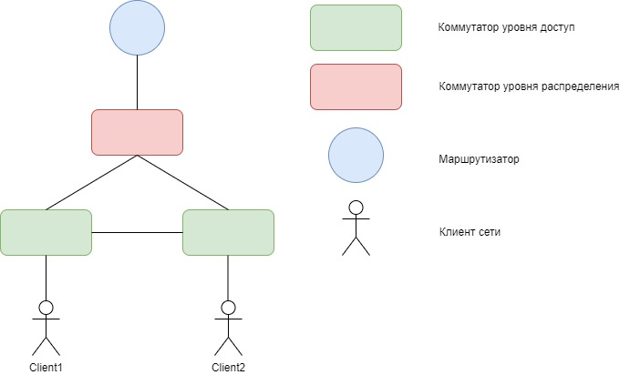

### В данной самостоятельной работы мы ожидаем:
1. Вы сможете собрать топологию, как показано на схеме:

2. Каждый клиент находится в своем VLAN, например:
   * Client1 находится в VLAN 10 и сети 10.0.10.0/24
   * Client2 находится в VLAN 20 и сети 10.0.20.0/24
3. В сети настроен протокол STP таким образом, что коммутатор уровня распределения является корнем сети для обоих VLAN
4. Клиенты могут отправить друг другу PING