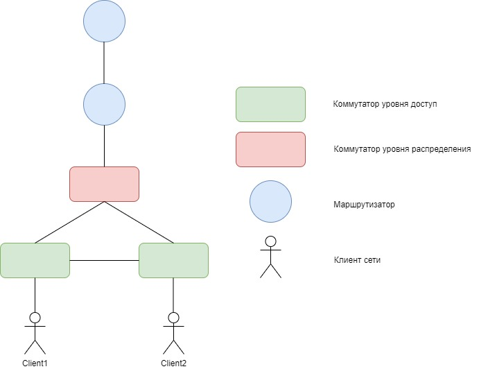

### Модернизация сети офиса из задания 1

В данной самостоятельной работе мы ожидаем от вас:
1. Привести схему сети из первой работы к схеме:

2. Все клиенты должны получаеть сетевые настройки по DHCP:
   1. IP адресс
   2. Маску сети
   3. DNS сервера
   4. Default Gateway
3. В настройках DHCP сервера необходимо исключить первые 10 IP адреса из выдачи клиентам
4. На маршрутизаторе с сетями клиентов настроена технология NAT, таким образом чтобы клиенты могли обратиться к верхнему маршрутизатору и получить ответ.
5. На верхнем маршрутизаторе нет дополнительных маршрутов в сети клиентов
6. **Опциально**. Настроить проброс порта 2022 в сторону клиента на порт 22 на нижнем маршрутизаторе. 

---

### Для сдачи работы требуется

Выгрузить конфигурации с сетевых устройств и загрузить на GitHub. В Readme.md подготовить выводы с устройств, подтверждающие работоспособность конфигурации.

Критерии оценки:

   * каждый выполненный пункт - 1 балл(пункты со 2 по 5)
   * 1 балл - настроен DHCP для обоих клиентов
   * 1 балл - настроены исключения из dhcp пула
   * 1 балл - NAT будет работать для большого количества клиентов(>10) в каждой сети
   * 1 балл - клиенты могут обратиться к верхнему маршрутизаторы только с использованием NAT.
   * 1 балл - оформлена документация - приведены схемы и примеры конфигурация, использованные в настройке
