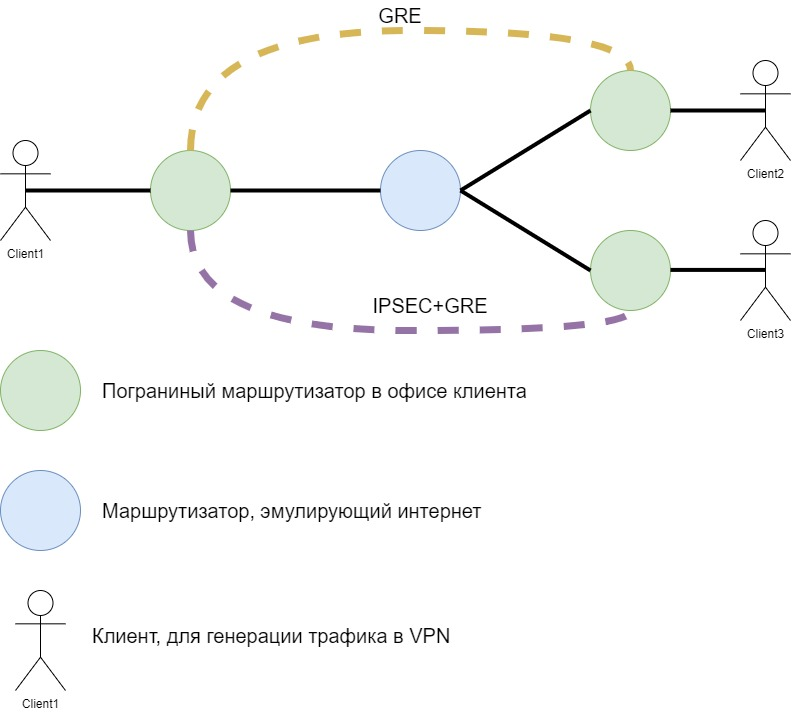

### Построение VPN тоннелей между офисами

В данной самостоятельной работе мы ожидаем от вас:
1. Необходимо собрать сеть в соответствии со схемой:

2. На пограничных устройствах настроен Default маршрут в сторону интернет. Удаленные сети доступны только через VPN
3. Маршрутизатор, эмулируюрущий интернет, не знает ни о каких сетях, кроме directly connect.
4. Трафик между Client1 и Client2 проходит через GRE тоннель без шифрования.
5. Трафик между Client1 и Client3 проходит через GRE тоннель поверх IPSEC с шифрование. Алгоритмы ширфрования на ваш выбор.
6. **Опциально**. Аутентификация IPSEC реализована с использованием сертификатов. В этом случае один из пограничных маршрутизаторов является CA.
---

### Для сдачи работы требуется

Выгрузить конфигурации с сетевых устройств и загрузить на GitHub. В Readme.md подготовить выводы с устройств, подтверждающие работоспособность конфигурации.

Критерии оценки:

   * каждый выполненный пункт - 2 балл(пункты с 1  по 5)
   * Опциональное задание дает 2 балла. Вместо любого пункта, где баллы были потеряны
